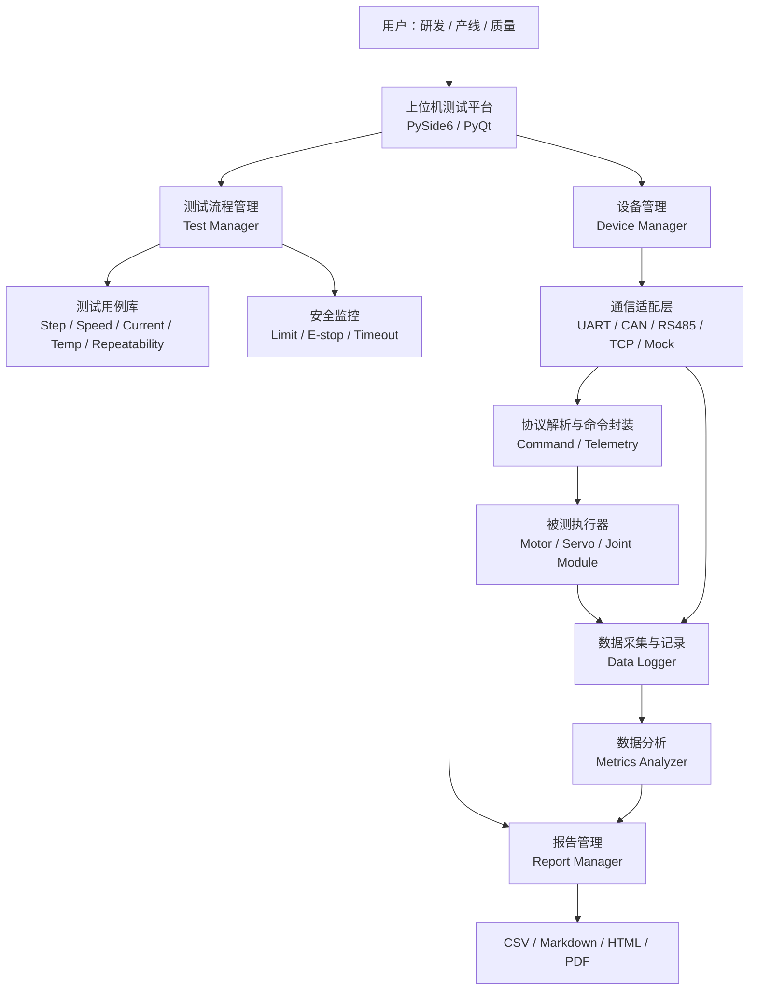
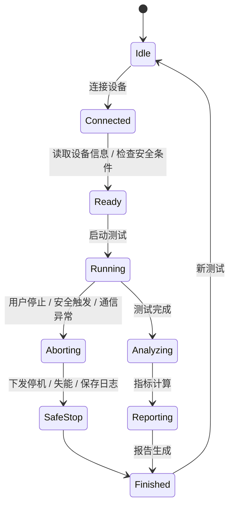
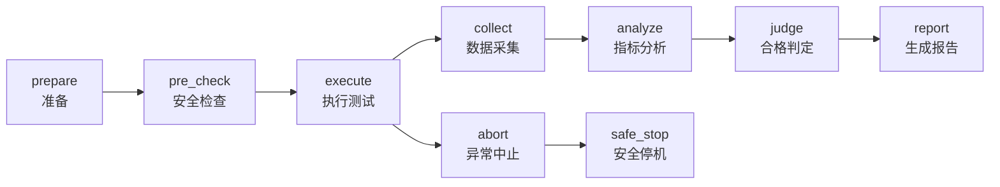

# JointBench Actuator Test Platform 产品设计报告

版本：V0.9  
日期：2026-05-24  
产品中文名：机器人关节模组测试与性能分析平台  
产品英文名：JointBench Actuator Test Platform  
文档状态：产品设计稿 / 可用于立项、开发拆解与项目展示

---

## 1. 产品概述

### 1.1 产品一句话定义

JointBench 是一套面向机器人关节模组、电机执行器、伺服驱动器和产线检测场景的上位机测试与性能分析平台。平台通过统一通信适配层连接模拟或真实执行器，自动执行位置、速度、电流、温升、重复定位等测试流程，实时采集状态数据，计算动态响应指标，并生成可追溯测试报告。

### 1.2 产品定位

JointBench 的定位不是单一调试工具，而是一个“小型执行器测试台架软件系统”。它同时覆盖研发调试、供应商验证、产线测试和问题复现闭环。

核心价值：

- 帮助研发工程师快速评估关节模组控制性能。
- 帮助测试工程师用标准化流程减少人工判断误差。
- 帮助产线建立 PASS / FAIL 自动判定与测试记录追溯。
- 帮助供应商管理场景对不同模组进行横向对比。
- 通过 Mock 执行器实现软硬件解耦，在没有真实硬件时仍可完成软件闭环开发。

### 1.3 产品边界

本平台聚焦执行器单体和小规模多执行器测试，不直接承担整机机器人控制、运动规划或复杂动力学仿真。

包含：

- 执行器连接、识别、使能和安全停机。
- 测试任务配置、执行、暂停、停止。
- 位置、速度、电流、电压、温度等状态采集。
- 阶跃响应、速度响应、限流、温升、重复定位等测试。
- 指标计算、合格判定、日志记录和报告导出。

不包含：

- 机器人整机运动规划。
- 高精度动力学建模与仿真。
- 批量产线 MES 系统的完整替代。
- 电机驱动固件内部控制算法开发。

---

## 2. 背景与问题定义

### 2.1 当前痛点

机器人关节模组测试通常存在以下问题：

- 测试过程依赖人工操作，步骤不统一。
- 示波器、串口助手、CAN 工具、Excel 分散使用，数据链路割裂。
- 响应性能主要靠肉眼看曲线，缺少自动指标计算。
- 异常问题难以复现，缺少完整命令、数据、日志记录。
- 产线测试需要快速判断，但研发调试工具不适合直接用于产线。
- 没有真实硬件时，上位机和分析模块开发容易被阻塞。

### 2.2 产品机会

执行器是机器人、智能制造和智能车辆底盘系统中的关键部件。围绕执行器建立一套标准化测试平台，可以把嵌入式通信、控制指令、数据采集、性能分析、产线判定和工程报告串成完整闭环。这类项目既有工程实用价值，也适合展示系统设计能力。

---

## 3. 目标用户与使用场景

### 3.1 研发调试工程师

典型目标：

- 验证关节模组的控制模式是否正常。
- 查看位置响应是否稳定，有无超调、振荡或抖动。
- 分析电流峰值、跟踪误差、响应延迟和温升表现。
- 快速复现固件版本或参数调整前后的性能差异。

典型流程：

1. 连接执行器。
2. 读取设备 ID、固件版本和当前状态。
3. 选择位置阶跃响应测试。
4. 设置目标角度、采样频率、测试时长和安全阈值。
5. 启动测试并观察实时曲线。
6. 自动计算指标并导出报告。

### 3.2 产线测试人员

典型目标：

- 快速判断关节模组是否合格。
- 绑定 SN、设备 ID、测试工位和操作员。
- 自动执行标准测试流程。
- 生成 PASS / FAIL 结果并保存记录。

典型流程：

1. 扫码录入 SN。
2. 插入模组并自动连接。
3. 点击一键测试。
4. 系统自动执行回零、阶跃、速度、电流、温度检查。
5. 输出 PASS / FAIL。
6. 保存测试数据和报告。

### 3.3 供应商质量验证工程师

典型目标：

- 对比不同供应商或不同批次模组性能。
- 评估响应速度、稳定性、电流波动、温升和重复定位精度。
- 留存来料验证记录。

典型流程：

1. 建立供应商与批次信息。
2. 批量导入测试计划。
3. 对多个样件执行统一测试。
4. 对比关键指标分布。
5. 导出批次分析报告。

### 3.4 售后与问题分析工程师

典型目标：

- 复现现场反馈的异常。
- 对比问题模组与正常模组的数据差异。
- 根据日志定位通信、控制、温度或电流异常。

---

## 4. 产品目标与成功指标

### 4.1 产品目标

- 建立统一执行器测试流程，减少人工测试差异。
- 支持模拟执行器与真实执行器切换，降低硬件依赖。
- 实时展示执行器状态，辅助调试和问题定位。
- 自动计算关键控制性能指标。
- 形成可追溯测试报告，支撑研发、质量和产线闭环。

### 4.2 成功指标

| 类别 | 指标 | 目标 |
|---|---|---|
| 可用性 | 新用户完成一次 Mock 阶跃测试耗时 | 小于 5 分钟 |
| 测试效率 | 单个模组标准测试耗时 | 小于 3 分钟，可配置 |
| 数据完整性 | 测试数据保存成功率 | 大于 99% |
| 计算准确性 | 指标计算误差 | 与离线脚本结果一致 |
| 可扩展性 | 新增通信适配器工作量 | 不影响测试流程模块 |
| 可靠性 | 通信异常识别时间 | 小于 1 秒，可配置 |
| 产线适配 | 自动 PASS / FAIL 输出 | 支持阈值配置与报告留档 |

---

## 5. 总体架构设计

### 5.1 逻辑架构



### 5.2 分层说明

| 层级 | 职责 | 设计重点 |
|---|---|---|
| UI 层 | 测试配置、设备连接、曲线展示、报告入口 | 低门槛、实时反馈、异常可见 |
| 应用服务层 | 测试流程编排、设备管理、报告生成 | 业务闭环与状态机 |
| 通信适配层 | 屏蔽 UART、CAN、RS485、TCP、Mock 差异 | 插件化、统一接口 |
| 协议层 | 命令编码、数据解析、心跳、错误码 | 可替换、可记录 |
| 数据层 | 采样缓存、CSV、SQLite、日志 | 可追溯、时间戳准确 |
| 分析层 | 响应指标、统计指标、合格判定 | 算法可测试 |
| 硬件层 | 真实执行器或模拟执行器 | 安全与状态反馈 |

### 5.3 推荐部署形态

研发调试版：

- 一台 PC。
- USB-CAN、USB-UART 或 TCP 网关。
- 单个执行器或 Mock 执行器。

产线测试版：

- 工控机。
- 固定通信接口。
- 扫码枪。
- 治具、电源、急停按钮。
- 本地数据库或共享文件服务器。

---

## 6. 核心业务流程

### 6.1 标准测试流程



### 6.2 位置阶跃响应流程

1. 检查设备连接、使能状态、温度、电压和急停状态。
2. 设置控制模式为位置模式。
3. 发送起始位置或回零命令。
4. 等待状态稳定。
5. 开始数据采集。
6. 下发目标位置，例如 30 deg。
7. 持续采集位置、速度、电流、电压、温度。
8. 到达测试时长或满足稳定条件后结束。
9. 下发安全停止或回到安全位置。
10. 计算响应指标。
11. 根据阈值输出 PASS / FAIL。
12. 生成报告和原始数据文件。

---

## 7. 功能需求设计

### 7.1 功能总览

| 模块 | 功能 | MVP | V1 | V2 |
|---|---|---:|---:|---:|
| 设备连接 | Mock 执行器 | 是 | 是 | 是 |
| 设备连接 | UART 适配 | 否 | 是 | 是 |
| 设备连接 | CAN 适配 | 否 | 是 | 是 |
| 设备连接 | RS485 / TCP 适配 | 否 | 可选 | 是 |
| 设备管理 | 读取设备 ID / 版本 / 状态 | Mock | 是 | 是 |
| 测试流程 | 位置阶跃响应 | 是 | 是 | 是 |
| 测试流程 | 速度响应 | 否 | 是 | 是 |
| 测试流程 | 电流限制 | 否 | 是 | 是 |
| 测试流程 | 温升测试 | 否 | 是 | 是 |
| 测试流程 | 重复定位 | 否 | 可选 | 是 |
| 数据显示 | 实时曲线 | 是 | 是 | 是 |
| 数据记录 | CSV 保存 | 是 | 是 | 是 |
| 数据记录 | SQLite 历史记录 | 否 | 可选 | 是 |
| 分析计算 | 超调量、调节时间、稳态误差 | 是 | 是 | 是 |
| 报告 | Markdown / HTML | 是 | 是 | 是 |
| 报告 | PDF | 否 | 可选 | 是 |
| 产线 | SN 绑定 / 条码输入 | 否 | 可选 | 是 |
| 产线 | 一键自动测试 | 否 | 是 | 是 |
| 质量 | 批次对比 | 否 | 否 | 是 |

### 7.2 设备连接与管理

功能要求：

- 支持选择通信类型：Mock、UART、CAN、RS485、TCP。
- 支持连接参数配置：串口号、波特率、CAN 通道、CAN ID、IP、端口。
- 支持连接测试和心跳检测。
- 支持读取设备基础信息：
  - 设备 ID。
  - SN。
  - 固件版本。
  - 硬件版本。
  - 当前控制模式。
  - 当前故障码。
  - 温度、电压、使能状态。
- 支持断连自动识别和日志记录。

### 7.3 测试配置管理

功能要求：

- 测试模式选择：
  - 位置阶跃响应。
  - 速度响应。
  - 电流限制。
  - 温升测试。
  - 重复定位。
  - 通信延迟。
  - 异常断连。
- 参数配置：
  - 目标位置 / 速度 / 电流。
  - 起始位置。
  - 测试时长。
  - 采样频率。
  - 稳定判定带宽。
  - 安全限位。
  - PASS / FAIL 阈值。
- 支持保存和加载测试模板。

### 7.4 实时监控与曲线显示

界面应至少展示：

- 目标位置与实际位置。
- 实际速度。
- 电流。
- 电压。
- 温度。
- 控制模式。
- 连接状态。
- 告警状态。
- 测试进度。

曲线要求：

- 支持实时刷新。
- 支持测试结束后缩放查看。
- 支持目标曲线与实际曲线叠加。
- 支持异常点标记。
- 支持导出曲线图片。

### 7.5 日志与异常记录

日志类型：

- 用户操作日志。
- 通信日志。
- 测试流程日志。
- 安全告警日志。
- 算法分析日志。

异常类型：

- 通信超时。
- 数据解析失败。
- 电流超限。
- 温度超限。
- 电压异常。
- 位置超限。
- 速度超限。
- 执行器故障码。
- 测试流程超时。

日志字段：

| 字段 | 说明 |
|---|---|
| timestamp | 本地时间戳 |
| level | INFO / WARNING / ERROR |
| source | UI / Adapter / TestCase / Safety / Analyzer |
| event_code | 事件码 |
| message | 文本描述 |
| test_id | 关联测试 ID |
| device_id | 关联设备 ID |

---

## 8. 通信适配层设计

### 8.1 设计目标

通信适配层用于屏蔽底层通信差异，使测试流程不关心设备是 Mock、UART、CAN、RS485 还是 TCP。

核心原则：

- 统一命令接口。
- 统一状态数据结构。
- 统一异常处理。
- 支持录制与回放。
- 支持 Mock 替换真实设备。

### 8.2 推荐目录结构

```text
jointbench/
  app/
    main_window.py
    widgets/
  comm/
    base_adapter.py
    mock_adapter.py
    uart_adapter.py
    can_adapter.py
    rs485_adapter.py
    tcp_adapter.py
    protocol.py
  devices/
    actuator_client.py
    device_models.py
  tests/
    base_test.py
    step_response_test.py
    speed_response_test.py
    current_limit_test.py
    temperature_rise_test.py
    repeatability_test.py
  analysis/
    step_response.py
    metrics.py
  logging/
    data_logger.py
    event_logger.py
  reports/
    report_builder.py
    templates/
  safety/
    safety_monitor.py
  storage/
    csv_store.py
    sqlite_store.py
  config/
    default_limits.yaml
    test_profiles.yaml
```

### 8.3 统一适配器接口

适配器应提供以下能力：

```python
class BaseAdapter:
    def connect(self) -> None: ...
    def disconnect(self) -> None: ...
    def is_connected(self) -> bool: ...
    def read_device_info(self) -> DeviceInfo: ...
    def set_enable(self, enabled: bool) -> None: ...
    def set_control_mode(self, mode: str) -> None: ...
    def send_position_command(self, position_deg: float) -> None: ...
    def send_speed_command(self, speed_dps: float) -> None: ...
    def send_current_command(self, current_a: float) -> None: ...
    def read_state(self) -> ActuatorState: ...
    def emergency_stop(self) -> None: ...
```

### 8.4 Mock 执行器设计

Mock 执行器是 MVP 的关键模块，不只是“假数据发生器”，而应模拟执行器基础动态特性。

推荐特性：

- 一阶或二阶系统位置响应。
- 可配置阻尼比、响应时间、最大速度、最大电流。
- 可注入噪声、延迟、超调、通信丢包和温升。
- 可模拟异常：过温、过流、断连、位置限位触发。

简化模型：

- 输入：目标位置。
- 输出：位置、速度、电流、温度、电压。
- 位置响应：二阶欠阻尼系统。
- 电流响应：与加速度、速度和负载相关的近似模型。
- 温度响应：与平均电流平方相关的慢速上升模型。

Mock 参数示例：

| 参数 | 默认值 | 说明 |
|---|---:|---|
| response_time | 0.35 s | 典型响应时间 |
| damping_ratio | 0.65 | 阻尼比 |
| max_speed | 180 deg/s | 最大速度 |
| max_current | 5 A | 最大电流 |
| noise_std | 0.05 deg | 编码器噪声 |
| comm_delay | 10 ms | 通信延迟 |
| drop_rate | 0% | 丢包率 |

---

## 9. 测试流程设计

### 9.1 测试用例抽象

每个测试用例应具备统一生命周期：



### 9.2 位置阶跃响应测试

目的：

- 评估位置控制响应速度、稳定性和精度。

输入参数：

| 参数 | 示例 | 说明 |
|---|---:|---|
| start_position_deg | 0 | 起始角度 |
| target_position_deg | 30 | 目标角度 |
| duration_s | 3 | 测试时长 |
| sample_rate_hz | 100 | 采样频率 |
| settling_band_pct | 2% | 稳定带宽 |
| max_overshoot_pct | 10% | 最大允许超调 |
| max_settling_time_s | 0.6 | 最大调节时间 |

输出指标：

- response_delay。
- rise_time。
- settling_time。
- overshoot。
- steady_state_error。
- peak_current。
- max_temperature。
- jitter。

### 9.3 速度响应测试

目的：

- 评估速度模式下的响应速度、稳态波动和速度跟踪能力。

关键指标：

- 速度上升时间。
- 速度超调量。
- 稳态速度误差。
- 速度纹波。
- 峰值电流。

### 9.4 电流限制测试

目的：

- 验证驱动器限流策略是否生效，避免异常负载下过流风险。

关键指标：

- 峰值电流。
- 限流触发时间。
- 限流后稳态电流。
- 故障码是否正确上报。

### 9.5 温升测试

目的：

- 评估执行器在持续负载或循环动作下的热稳定性。

关键指标：

- 最高温度。
- 温升速率。
- 稳态温度。
- 过温保护触发点。

### 9.6 重复定位测试

目的：

- 评估多次往返运动后的位置重复精度。

关键指标：

- 最大定位误差。
- 平均定位误差。
- 标准差。
- 回差。

---

## 10. 数据采集与数据模型

### 10.1 采样原则

- 所有数据必须带时间戳。
- 优先使用单调时钟记录相对时间，避免系统时间调整造成曲线异常。
- 采样线程与 UI 刷新线程分离。
- 原始数据先完整保存，再生成分析结果。
- 测试 ID 贯穿原始数据、日志、指标和报告。

### 10.2 执行器状态数据结构

| 字段 | 单位 | 说明 |
|---|---|---|
| timestamp_s | s | 测试开始后的相对时间 |
| device_time_ms | ms | 设备时间戳，可选 |
| target_position_deg | deg | 目标位置 |
| actual_position_deg | deg | 实际位置 |
| target_speed_dps | deg/s | 目标速度 |
| actual_speed_dps | deg/s | 实际速度 |
| current_a | A | 电流 |
| voltage_v | V | 母线电压 |
| temperature_c | degC | 温度 |
| control_mode | enum | 控制模式 |
| enabled | bool | 使能状态 |
| fault_code | int | 故障码 |

### 10.3 CSV 原始数据格式

```csv
test_id,sample_index,timestamp_s,target_position_deg,actual_position_deg,actual_speed_dps,current_a,voltage_v,temperature_c,fault_code
JB20260524-0001,0,0.000,0.0,0.02,0.0,0.12,24.1,31.2,0
JB20260524-0001,1,0.010,30.0,0.18,15.4,0.45,24.1,31.2,0
```

### 10.4 测试记录数据结构

| 字段 | 说明 |
|---|---|
| test_id | 唯一测试 ID |
| test_type | 测试类型 |
| device_id | 设备 ID |
| sn | 序列号 |
| operator | 操作员 |
| firmware_version | 固件版本 |
| adapter_type | 通信方式 |
| config_snapshot | 测试配置快照 |
| start_time | 开始时间 |
| end_time | 结束时间 |
| result | PASS / FAIL / ABORTED |
| metrics | 指标 JSON |
| report_path | 报告路径 |
| raw_data_path | 原始数据路径 |

---

## 11. 性能指标与算法设计

### 11.1 指标定义

| 指标 | 英文 | 定义 |
|---|---|---|
| 响应延迟 | response_delay | 指令下发后，实际位置首次明显偏离起始值的时间 |
| 上升时间 | rise_time | 响应从 10% 到 90% 目标变化量所需时间 |
| 超调量 | overshoot | 最大响应值超过目标值的比例 |
| 调节时间 | settling_time | 响应进入并持续保持在目标值稳定带宽内的时间 |
| 稳态误差 | steady_state_error | 测试末段实际值均值与目标值之差 |
| 峰值电流 | peak_current | 测试期间电流绝对值最大值 |
| 平均电流 | average_current | 测试期间电流平均值或绝对值平均值 |
| 最高温度 | max_temperature | 测试期间最高温度 |
| 跟踪误差 | tracking_error | 目标曲线与实际曲线的误差统计 |
| 抖动 | jitter | 稳态区间内位置或速度波动程度 |

### 11.2 阶跃响应计算逻辑

假设起始位置为 `p0`，目标位置为 `pt`，阶跃幅值为 `delta = pt - p0`。

响应延迟：

- 找到实际位置变化量首次超过 `max(0.5 deg, 2% * abs(delta))` 的时间。

上升时间：

- 正向阶跃：找到首次达到 `p0 + 10% * delta` 和 `p0 + 90% * delta` 的时间差。
- 反向阶跃：按方向取相应阈值。

超调量：

- 正向阶跃：`(max_position - pt) / abs(delta) * 100%`。
- 反向阶跃：`(pt - min_position) / abs(delta) * 100%`。
- 若未超过目标值，则超调量为 0。

调节时间：

- 稳定带宽默认为目标阶跃幅值的 ±2%。
- 从响应开始后查找第一个时间点，使其之后所有点都处于稳定带宽内。
- 工程实现中可允许短暂噪声，通过连续窗口判定降低误判。

稳态误差：

- 取测试末尾 10% 时间窗口的位置均值。
- `steady_state_error = mean(actual_position_tail) - target_position`。

抖动：

- 取稳态窗口内位置标准差或峰峰值。

### 11.3 PASS / FAIL 判定示例

| 指标 | 默认阈值 | 结果影响 |
|---|---:|---|
| overshoot | <= 10% | 超出则 FAIL |
| settling_time | <= 0.6 s | 超出则 FAIL |
| steady_state_error | <= 0.5 deg | 超出则 FAIL |
| peak_current | <= 5 A | 超出则 FAIL |
| max_temperature | <= 70 degC | 超出则 FAIL |
| communication_timeout | 0 次 | 出现则 FAIL 或 ABORTED |

判定建议：

- 安全类异常优先级最高，直接 ABORTED 或 FAIL。
- 性能类指标超限为 FAIL。
- 指标缺失或数据不完整为 INVALID，不应误判为 PASS。

---

## 12. 安全保护设计

### 12.1 安全目标

执行器测试涉及机械运动、电流、温升和通信失控风险，因此平台必须把安全保护作为一等功能，而不是后期补丁。

### 12.2 软件安全保护

| 保护项 | 说明 | 动作 |
|---|---|---|
| 软限位 | 位置超过配置边界 | 停止测试并下发安全位置或失能 |
| 速度限制 | 速度超过阈值 | 停止测试 |
| 电流限制 | 电流超过阈值 | 停止测试并记录峰值 |
| 温度限制 | 温度超过阈值 | 停止测试并等待冷却 |
| 电压异常 | 电压过高或过低 | 停止测试 |
| 通信超时 | 超过心跳周期无反馈 | 下发急停并标记 ABORTED |
| 故障码 | 设备上报故障 | 停止测试并记录故障码 |

### 12.3 安全状态机

安全监控独立于测试用例运行。任何测试过程中，Safety Monitor 都可以抢占测试流程，触发 `safe_stop`。

优先级：

1. 急停输入。
2. 通信失联。
3. 位置 / 速度 / 电流 / 温度硬阈值。
4. 设备故障码。
5. 测试流程超时。

### 12.4 硬件安全建议

产线或真实执行器测试建议配置：

- 物理急停按钮。
- 独立电源开关。
- 可限流电源。
- 机械限位或安全治具。
- 透明防护罩。
- 单人可操作的复位流程。

---

## 13. 上位机产品界面设计

### 13.1 信息架构

推荐主界面采用工程工具布局：

- 顶部：连接状态、测试模式、全局操作按钮。
- 左侧：设备列表、通信配置、测试模板。
- 中间：实时曲线与关键指标。
- 右侧：设备状态、安全阈值、PASS / FAIL 结果。
- 底部：日志、通信事件、异常记录。

### 13.2 页面结构

| 页面 | 用途 |
|---|---|
| Dashboard | 当前设备状态、快速启动测试 |
| Test Config | 测试参数、阈值、模板管理 |
| Live Test | 实时曲线、状态、控制按钮 |
| Results | 指标表、PASS / FAIL、报告入口 |
| History | 历史测试查询与对比 |
| Settings | 通信配置、安全阈值、报告模板 |

### 13.3 核心交互

连接设备：

1. 用户选择通信方式。
2. 输入或选择连接参数。
3. 点击连接。
4. 系统读取设备信息并进行安全预检查。

启动测试：

1. 用户选择测试模板。
2. 修改目标参数。
3. 系统显示预计动作范围和安全限制。
4. 用户点击启动。
5. 系统进入 Running 状态。

测试完成：

1. 曲线停止刷新。
2. 指标自动计算。
3. 结果区显示 PASS / FAIL。
4. 用户可打开报告或导出数据。

异常处理：

1. 异常弹窗简洁提示。
2. 日志区保留详细原因。
3. 系统保存已采集数据。
4. 进入安全停止状态。

---

## 14. 报告生成设计

### 14.1 报告目标

报告应同时满足研发分析和质量追溯：

- 能说明测试对象是谁。
- 能说明测试条件是什么。
- 能说明测试过程有没有异常。
- 能说明关键指标是否合格。
- 能查看原始数据和曲线。

### 14.2 报告内容

| 区块 | 内容 |
|---|---|
| 基本信息 | 测试 ID、测试时间、测试人员、工位、设备 ID、SN |
| 设备信息 | 硬件版本、固件版本、通信方式、控制模式 |
| 测试配置 | 测试类型、目标位置、采样频率、测试时长、安全阈值 |
| 结果摘要 | PASS / FAIL / ABORTED、失败原因 |
| 指标表 | 超调量、调节时间、稳态误差、峰值电流、最高温度 |
| 曲线 | 位置、速度、电流、温度 |
| 异常记录 | 告警、故障码、通信异常 |
| 文件索引 | 原始 CSV、日志文件、配置快照 |

### 14.3 报告格式路线

MVP：

- CSV 原始数据。
- Markdown 报告。
- HTML 报告。

V1：

- HTML 带曲线图片。
- 可归档测试目录。

V2：

- PDF 报告。
- 批量报告导出。
- 批次统计报告。

### 14.4 报告目录示例

```text
reports/
  JB20260524-0001/
    report.md
    report.html
    raw_data.csv
    events.log
    config_snapshot.yaml
    position_curve.png
    current_curve.png
```

---

## 15. 技术方案建议

### 15.1 推荐技术栈

| 模块 | 推荐方案 | 理由 |
|---|---|---|
| 上位机 UI | Python + PySide6 / PyQt | 开发快、生态成熟、适合工程工具 |
| 实时曲线 | pyqtgraph | 性能好，适合实时数据 |
| 数据处理 | numpy / pandas | 指标计算和数据清洗方便 |
| 报告模板 | Jinja2 + Markdown / HTML | 可维护、易扩展 |
| 串口通信 | pyserial | 成熟稳定 |
| CAN 通信 | python-can | 跨设备支持较好 |
| 配置文件 | YAML | 人类可读，适合测试模板 |
| 本地存储 | CSV + SQLite | MVP 简单，V2 可查询 |
| 测试框架 | pytest | 算法和 Mock 可自动化验证 |
| 打包 | PyInstaller | 方便 Windows 工控机场景部署 |

### 15.2 可选技术路线对比

| 技术路线 | 优点 | 缺点 | 建议 |
|---|---|---|---|
| Python + PySide6 | 快速、易演示、适合算法 | 大型工程需注意结构 | 首选 |
| C# WPF | Windows 原生体验好 | 开发节奏较慢 | 产线正式版可选 |
| Web + Electron | UI 表现力强 | 本地硬件通信复杂一些 | 后续可选 |
| Web + FastAPI | 架构清晰、远程访问方便 | 初版复杂度略高 | 多工位平台化时考虑 |

---

## 16. 非功能需求

### 16.1 性能要求

- MVP 采样频率：100 Hz。
- V1 目标采样频率：500 Hz，取决于设备通信能力。
- UI 曲线刷新频率：20 至 60 Hz。
- 测试结束后 2 秒内生成指标结果。
- 标准 HTML 报告 5 秒内生成。

### 16.2 可靠性要求

- 通信异常必须被识别并记录。
- 测试中止后不得丢失已采集数据。
- 报告生成失败不应影响原始数据保存。
- Mock 测试应可重复，支持固定随机种子。

### 16.3 可维护性要求

- 通信适配器、测试用例、分析算法相互解耦。
- 新增测试用例不应修改 UI 核心逻辑。
- 指标算法应有单元测试。
- 配置项应外置，不硬编码阈值。

### 16.4 可追溯性要求

每次测试必须保存：

- 测试 ID。
- 设备 ID / SN。
- 测试配置快照。
- 原始采样数据。
- 分析结果。
- 事件日志。
- 报告文件路径。

---

## 17. 开发路线图

### 17.1 阶段 1：MVP 闭环

目标：

- 没有真实硬件也能完成完整测试闭环。

功能范围：

- Mock 执行器。
- PySide6 上位机基础界面。
- 位置阶跃测试。
- 实时曲线。
- CSV 数据保存。
- 超调量、调节时间、稳态误差计算。
- Markdown / HTML 报告。

验收标准：

- 点击开始测试后曲线实时变化。
- 可看到目标位置与实际位置。
- 测试结束后自动输出指标。
- 生成包含曲线和指标的报告。

### 17.2 阶段 2：分析能力增强

目标：

- 指标计算稳定可靠，可用于对比不同参数或不同模组。

功能范围：

- 响应延迟。
- 上升时间。
- 抖动。
- 峰值电流、平均电流。
- 最高温度。
- PASS / FAIL 阈值配置。
- 指标算法单元测试。

验收标准：

- 输入标准测试数据，输出指标与离线参考结果一致。
- 阈值变化后 PASS / FAIL 结果正确更新。

### 17.3 阶段 3：真实通信接入

目标：

- 从 Mock 切换到真实执行器。

优先级：

1. UART。
2. CAN。
3. RS485。
4. TCP。

功能范围：

- 真实设备连接。
- 设备状态读取。
- 控制指令下发。
- 通信超时处理。
- 通信日志。

验收标准：

- 能读取真实设备状态。
- 能下发位置或速度命令。
- 通信异常可识别。
- 数据能被记录和分析。

### 17.4 阶段 4：产线化与质量追溯

目标：

- 具备小型产线测试工具形态。

功能范围：

- SN / 条码绑定。
- 一键自动测试。
- 测试模板锁定。
- SQLite 历史记录。
- 批量报告导出。
- 操作员、工位、批次记录。

验收标准：

- 产线人员无需修改复杂参数即可执行测试。
- 每个 SN 都能查询历史报告。
- 异常样件有完整失败原因。

---

## 18. 项目里程碑

| 里程碑 | 周期 | 交付物 |
|---|---|---|
| M0 需求冻结 | 第 1 周 | 产品设计报告、MVP 范围、指标定义 |
| M1 Mock 闭环 | 第 2 周 | Mock 执行器、基础数据采集、CSV |
| M2 UI 原型 | 第 3 周 | 上位机界面、曲线显示、测试按钮 |
| M3 指标分析 | 第 4 周 | 阶跃响应算法、结果表 |
| M4 报告生成 | 第 5 周 | Markdown / HTML 报告 |
| M5 UART 接入 | 第 6-7 周 | 串口适配器、真实设备初测 |
| M6 CAN 接入 | 第 8-9 周 | CAN 适配器、通信异常处理 |
| M7 产线流程 | 第 10-12 周 | 一键测试、SN 绑定、历史记录 |

---

## 19. 风险与应对

| 风险 | 影响 | 应对 |
|---|---|---|
| 真实硬件暂不可用 | 阻塞通信与控制验证 | 优先开发 Mock 执行器，保持软件闭环 |
| 不同执行器协议差异大 | 适配成本上升 | 设计统一设备抽象与协议插件 |
| 高频采样导致 UI 卡顿 | 影响实时体验 | 数据采集线程与 UI 分离，曲线降采样显示 |
| 指标计算受噪声影响 | 误判 PASS / FAIL | 使用窗口判定、滤波和原始数据保留 |
| 安全保护不足 | 可能损坏设备 | 安全监控独立运行，异常时抢占测试流程 |
| 报告与原始数据不一致 | 影响追溯 | 报告引用测试配置快照和原始数据路径 |
| 产线人员误改参数 | 影响测试一致性 | 测试模板锁定，区分研发模式和产线模式 |

---

## 20. MVP 验收清单

必须完成：

- 支持 Mock 执行器连接。
- 支持位置阶跃测试配置。
- 支持开始、停止、异常中止。
- 支持目标位置和实际位置实时曲线。
- 支持电流、速度、温度模拟数据。
- 支持 CSV 原始数据保存。
- 支持计算超调量、调节时间、稳态误差、峰值电流。
- 支持 PASS / FAIL 简单判定。
- 支持 Markdown 或 HTML 报告生成。

演示脚本：

1. 打开 JointBench 上位机。
2. 选择 Mock Adapter。
3. 点击 Connect。
4. 选择 Position Step Response。
5. 设置目标位置 30 deg。
6. 点击 Start。
7. 观察位置、电流、速度曲线实时变化。
8. 测试结束后查看指标表。
9. 打开自动生成的测试报告。

---

## 21. 后续增强方向

### 21.1 多关节测试

支持多个执行器同时连接，适用于机器人腿部、手臂或灵巧手模组测试。

关键点：

- 多设备同步采样。
- 多曲线对比。
- 设备 ID 与通道映射。
- 单设备异常不影响整体数据保存。

### 21.2 数据库与历史对比

支持按以下维度查询：

- SN。
- 供应商。
- 批次。
- 固件版本。
- 测试类型。
- PASS / FAIL。
- 指标范围。

### 21.3 ROS2 / 机器人诊断联动

可扩展为：

- 发布执行器状态到 ROS2 topic。
- 从 ROS2 接收测试命令。
- 与机器人诊断工具链集成。

### 21.4 自动参数整定辅助

后续可增加：

- PID 参数对比。
- 多组测试自动执行。
- 指标评分。
- 推荐参数区间。

---

## 22. 简历与项目表达

推荐简历描述：

独立设计并实现机器人关节模组测试与性能分析平台 JointBench，支持执行器控制指令下发、状态数据采集、阶跃响应测试、异常日志记录和自动报告生成；围绕超调量、调节时间、稳态误差、峰值电流、温升等指标建立关节模组性能评估流程，并通过 Mock 执行器与 UART / CAN 通信适配层实现软硬件解耦验证，形成从研发调试到产线 PASS / FAIL 判定的测试闭环。

可量化补充：

- 支持 100 Hz 以上数据采样和实时曲线显示。
- 支持位置阶跃响应自动分析与报告生成。
- 支持通信异常、过流、过温、位置超限等安全保护。
- 支持测试配置、原始数据、事件日志和分析结果关联追溯。

---

## 23. 总结

JointBench 的核心竞争力在于把“执行器控制 + 通信适配 + 数据采集 + 指标分析 + 自动报告 + 安全保护”整合成一个完整工程闭环。相比单纯的上位机 Demo，它更接近真实机器人公司、智能制造团队或产线测试工位会需要的内部工具。

建议优先实现 MVP：Mock 执行器、位置阶跃测试、实时曲线、CSV 保存、指标分析和 HTML 报告。完成 MVP 后，再逐步接入 UART / CAN 真实设备，并扩展产线化能力。这样可以在硬件资源不确定的情况下，稳定推进项目，同时保证最终展示效果足够完整、可信且有工程含金量。
